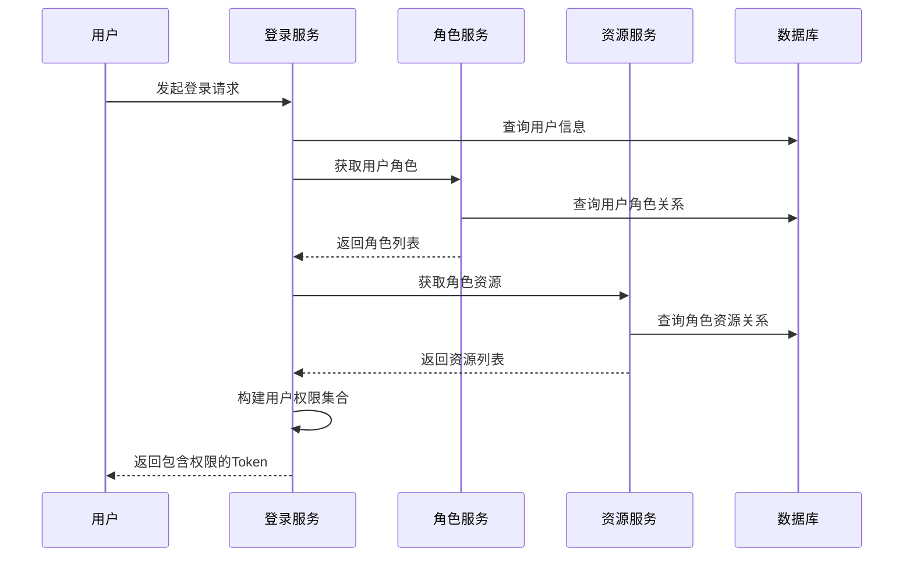

# 权限分配与使用指南

## 目录
1. [权限分配实现原理](#权限分配实现原理)
2. [数据库设计详解](#数据库设计详解)
3. [权限分配的具体实现](#权限分配的具体实现)
4. [权限验证的使用方法](#权限验证的使用方法)
5. [实际开发中的权限控制](#实际开发中的权限控制)
6. [常见问题与解决方案](#常见问题与解决方案)

## 权限分配实现原理

### 1. RBAC模型架构

本项目采用经典的RBAC（Role-Based Access Control）模型，通过三层关联实现权限控制：

```
用户(User) ←→ 用户角色(UserRole) ←→ 角色(Role) ←→ 角色资源(RoleResource) ←→ 资源(Resource)
```

### 2. 权限数据流转过程



## 数据库设计详解

### 1. 核心表结构

#### 1.1 用户表 (sys_user)
```sql
CREATE TABLE sys_user (
    id BIGINT PRIMARY KEY AUTO_INCREMENT,
    username VARCHAR(50) NOT NULL UNIQUE COMMENT '用户名',
    password VARCHAR(100) NOT NULL COMMENT '密码(BCrypt加密)',
    email VARCHAR(100) COMMENT '邮箱',
    phone_number VARCHAR(20) COMMENT '手机号',
    avatar VARCHAR(255) COMMENT '头像URL',
    create_by BIGINT COMMENT '创建者',
    create_time DATETIME COMMENT '创建时间',
    update_by BIGINT COMMENT '更新者',
    update_time DATETIME COMMENT '更新时间',
    remark VARCHAR(500) COMMENT '备注',
    data_state VARCHAR(10) COMMENT '数据状态'
);
```

#### 1.2 角色表 (sys_role)
```sql
CREATE TABLE sys_role (
    id BIGINT PRIMARY KEY AUTO_INCREMENT,
    role_name VARCHAR(50) NOT NULL COMMENT '角色名称',
    label VARCHAR(50) NOT NULL COMMENT '权限标识',
    sort_no INT COMMENT '排序',
    create_by BIGINT COMMENT '创建者',
    create_time DATETIME COMMENT '创建时间',
    update_by BIGINT COMMENT '更新者',
    update_time DATETIME COMMENT '更新时间',
    remark VARCHAR(500) COMMENT '备注',
    data_state VARCHAR(10) COMMENT '数据状态'
);
```

#### 1.3 资源表 (sys_resource)
```sql
CREATE TABLE sys_resource (
    id BIGINT PRIMARY KEY AUTO_INCREMENT,
    resource_no VARCHAR(50) NOT NULL COMMENT '资源编号',
    parent_resource_no VARCHAR(50) COMMENT '父资源编号',
    resource_name VARCHAR(100) NOT NULL COMMENT '资源名称',
    resource_type VARCHAR(10) NOT NULL COMMENT '资源类型(m:菜单,r:请求,b:按钮)',
    request_path VARCHAR(255) COMMENT '请求地址',
    label VARCHAR(100) COMMENT '权限标识',
    sort_no INT COMMENT '排序',
    icon VARCHAR(100) COMMENT '图标',
    create_by BIGINT COMMENT '创建者',
    create_time DATETIME COMMENT '创建时间',
    update_by BIGINT COMMENT '更新者',
    update_time DATETIME COMMENT '更新时间',
    remark VARCHAR(500) COMMENT '备注',
    data_state VARCHAR(10) COMMENT '数据状态'
);
```

#### 1.4 用户角色关联表 (sys_user_role)
```sql
CREATE TABLE sys_user_role (
    id BIGINT PRIMARY KEY AUTO_INCREMENT,
    user_id BIGINT NOT NULL COMMENT '用户ID',
    role_id BIGINT NOT NULL COMMENT '角色ID',
    create_by BIGINT COMMENT '创建者',
    create_time DATETIME COMMENT '创建时间',
    update_by BIGINT COMMENT '更新者',
    update_time DATETIME COMMENT '更新时间',
    remark VARCHAR(500) COMMENT '备注',
    data_state VARCHAR(10) COMMENT '数据状态',
    UNIQUE KEY uk_user_role (user_id, role_id)
);
```

#### 1.5 角色资源关联表 (sys_role_resource)
```sql
CREATE TABLE sys_role_resource (
    id BIGINT PRIMARY KEY AUTO_INCREMENT,
    role_id BIGINT NOT NULL COMMENT '角色ID',
    resource_no VARCHAR(50) NOT NULL COMMENT '资源编号',
    create_by BIGINT COMMENT '创建者',
    create_time DATETIME COMMENT '创建时间',
    update_by BIGINT COMMENT '更新者',
    update_time DATETIME COMMENT '更新时间',
    remark VARCHAR(500) COMMENT '备注',
    data_state VARCHAR(10) COMMENT '数据状态',
    UNIQUE KEY uk_role_resource (role_id, resource_no)
);
```

### 2. 权限数据示例

#### 2.1 角色数据
```sql
INSERT INTO sys_role (id, role_name, label, sort_no) VALUES
(1, '超级管理员', 'ADMIN', 1),
(2, '普通用户', 'USER', 2),
(3, '访客', 'GUEST', 3);
```

#### 2.2 资源数据
```sql
INSERT INTO sys_resource (id, resource_no, parent_resource_no, resource_name, resource_type, request_path, label, sort_no) VALUES
-- 菜单资源
(1, 'R001', NULL, '用户管理', 'm', NULL, 'user:manage', 1),
(2, 'R002', NULL, '订单管理', 'm', NULL, 'order:manage', 2),
(3, 'R003', NULL, '系统设置', 'm', NULL, 'system:manage', 3),

-- 用户管理子资源
(4, 'R001001', 'R001', '用户列表', 'r', 'GET/api/user/list', 'user:list', 1),
(5, 'R001002', 'R001', '创建用户', 'r', 'POST/api/user/create', 'user:create', 2),
(6, 'R001003', 'R001', '更新用户', 'r', 'PUT/api/user/update/*', 'user:update', 3),
(7, 'R001004', 'R001', '删除用户', 'r', 'DELETE/api/user/delete/*', 'user:delete', 4),

-- 订单管理子资源
(8, 'R002001', 'R002', '订单列表', 'r', 'GET/api/order/list', 'order:list', 1),
(9, 'R002002', 'R002', '创建订单', 'r', 'POST/api/order/create', 'order:create', 2),
(10, 'R002003', 'R002', '更新订单', 'r', 'PUT/api/order/update/*', 'order:update', 3),

-- 按钮权限
(11, 'R001005', 'R001', '导出用户', 'b', NULL, 'user:export', 5),
(12, 'R002004', 'R002', '导出订单', 'b', NULL, 'order:export', 4);
```

#### 2.3 用户角色关联
```sql
INSERT INTO sys_user_role (user_id, role_id) VALUES
(1, 1),  -- 用户1拥有超级管理员角色
(2, 2),  -- 用户2拥有普通用户角色
(3, 3);  -- 用户3拥有访客角色
```

#### 2.4 角色资源关联
```sql
INSERT INTO sys_role_resource (role_id, resource_no) VALUES
-- 超级管理员拥有所有权限
(1, 'R001'), (1, 'R002'), (1, 'R003'),  -- 菜单权限
(1, 'R001001'), (1, 'R001002'), (1, 'R001003'), (1, 'R001004'),  -- 用户管理权限
(1, 'R002001'), (1, 'R002002'), (1, 'R002003'),  -- 订单管理权限
(1, 'R001005'), (1, 'R002004'),  -- 按钮权限

-- 普通用户权限
(2, 'R001'), (2, 'R002'),  -- 菜单权限
(2, 'R001001'), (2, 'R001002'),  -- 用户查看和创建权限
(2, 'R002001'), (2, 'R002002'),  -- 订单查看和创建权限
(2, 'R001005'),  -- 导出用户权限

-- 访客权限
(3, 'R001'), (3, 'R002'),  -- 菜单权限
(3, 'R001001'),  -- 只能查看用户列表
(3, 'R002001');  -- 只能查看订单列表
```

## 权限分配的具体实现

### 1. 登录时权限加载

#### 1.1 LoginServiceImpl.login() 方法详解

```java
public LoginVo login(LoginDto loginDto) {
    // 步骤1：用户认证
    UsernamePasswordAuthenticationToken authenticationToken = 
        new UsernamePasswordAuthenticationToken(loginDto.getUsername(), loginDto.getPassword());
    Authentication authenticate = authenticationManager.authenticate(authenticationToken);
    
    // 步骤2：获取用户基础信息
    UserAuth userAuth = (UserAuth) authenticate.getPrincipal();
    LoginVo userLoginVo = BeanUtil.copyProperties(userAuth, LoginVo.class);
    
    // 步骤3：获取用户角色权限
    List<Role> roleList = roleService.getRoleListByUserId(userAuth.getId());
    Set<String> roleLabelsSet = roleList.stream().map(Role::getLabel).collect(Collectors.toSet());
    userLoginVo.setRoleLabels(roleLabelsSet);
    
    // 步骤4：获取用户资源权限（关键步骤）
    List<Resource> resourceList = resourceService.getResourceListByUserId(userAuth.getId());
    Set<String> resourceLabelSet = resourceList.stream()
        .filter(resource -> "r".equals(resource.getResourceType()))  // 只获取请求类型的资源
        .map(Resource::getRequestPath)  // 获取请求路径
        .collect(Collectors.toSet());
    userLoginVo.setResourcePaths(resourceLabelSet);
    
    // 步骤5：生成Token并存储
    // ... Token生成逻辑
}
```

#### 1.2 权限查询实现

**RoleServiceImpl.getRoleListByUserId()**
```java
@Override
public List<Role> getRoleListByUserId(String id) {
    return roleMapper.getRoleListByUserId(Long.valueOf(id));
}

// 对应的SQL查询
@Select("select distinct sys_role.* from sys_role left join sys_user_role on sys_role.id=sys_user_role.role_id " +
        "where sys_user_role.user_id=#{userId}")
List<Role> getRoleListByUserId(Long userId);
```

**ResourceServiceImpl.getResourceListByUserId()**
```java
public List<Resource> getResourceListByUserId(String id) {
    Long userId = Long.parseLong(id);
    
    // 1. 获取用户的所有角色
    List<Role> roles = roleMapper.getRoleListByUserId(userId);
    List<Resource> resourceList = new ArrayList<>();
    
    // 2. 遍历角色，获取每个角色的资源
    for (Role role : roles) {
        Long roleId = role.getId();
        List<Resource> resources = resourceMapper.getResourceByRoleId(roleId);
        
        // 3. 去重处理（避免多个角色有相同资源）
        for (Resource resource : resources) {
            if (!resourceList.contains(resource)) {
                resourceList.add(resource);
            }
        }
    }
    return resourceList;
}

// 对应的SQL查询
@Select("SELECT distinct r.* from sys_resource r left join sys_role_resource rr " +
        "on r.resource_no=rr.resource_no where rr.role_id=#{roleId}")
List<Resource> getResourceByRoleId(Long roleId);
```

### 2. 权限验证实现

#### 2.1 JwtAuthorizationManager 权限验证

```java
@Override
public AuthorizationDecision check(Supplier<Authentication> authentication, RequestAuthorizationContext requestContext) {
    // ... 前面的Token验证逻辑
    
    // 关键步骤：验证资源访问权限
    if (hasResourceAccessPermission(loginVo, requestMethodAndPath)) {
        return new AuthorizationDecision(true);
    }
    
    return new AuthorizationDecision(false);
}

private boolean hasResourceAccessPermission(LoginVo loginVo, String requestMethodAndPath) {
    Set<String> resourcePaths = loginVo.getResourcePaths();
    if (resourcePaths == null || resourcePaths.isEmpty()) {
        return false;
    }

    // 使用AntPathMatcher匹配资源路径（支持通配符）
    return resourcePaths.stream()
        .anyMatch(resourcePath -> antPathMatcher.match(resourcePath, requestMethodAndPath));
}
```

#### 2.2 权限匹配示例

```java
// 用户拥有的权限路径
Set<String> userResourcePaths = Set.of(
    "GET/api/user/list",
    "POST/api/user/create",
    "PUT/api/user/update/*",
    "GET/api/order/list"
);

// 请求匹配示例
String request1 = "GET/api/user/list";           // ✅ 匹配
String request2 = "POST/api/user/create";         // ✅ 匹配
String request3 = "PUT/api/user/update/123";      // ✅ 匹配（通配符）
String request4 = "DELETE/api/user/delete/123";    // ❌ 不匹配（无权限）
String request5 = "POST/api/order/create";         // ❌ 不匹配（无权限）
```

## 权限验证的使用方法

### 1. 在Controller中使用权限验证

#### 1.1 基础权限验证

```java
@RestController
@RequestMapping("/api/user")
public class UserController {
    
    // 方式1：使用@PreAuthorize注解（推荐）
    @GetMapping("/list")
    @PreAuthorize("hasAuthority('GET/api/user/list')")
    public Result<List<User>> getUserList() {
        // 只有拥有'GET/api/user/list'权限的用户才能访问
        return Result.success(userService.getAllUsers());
    }
    
    @PostMapping("/create")
    @PreAuthorize("hasAuthority('POST/api/user/create')")
    public Result<User> createUser(@RequestBody UserDto userDto) {
        return Result.success(userService.createUser(userDto));
    }
    
    @PutMapping("/update/{id}")
    @PreAuthorize("hasAuthority('PUT/api/user/update/*')")
    public Result<User> updateUser(@PathVariable Long id, @RequestBody UserDto userDto) {
        return Result.success(userService.updateUser(id, userDto));
    }
    
    // 方式2：手动权限验证
    @DeleteMapping("/delete/{id}")
    public Result<Void> deleteUser(@PathVariable Long id) {
        // 获取当前用户权限
        Authentication authentication = SecurityContextHolder.getContext().getAuthentication();
        UserAuth userAuth = (UserAuth) authentication.getPrincipal();
        
        // 检查权限
        boolean hasPermission = userAuth.getAuthorities().stream()
            .anyMatch(auth -> auth.getAuthority().equals("DELETE/api/user/delete/*"));
            
        if (!hasPermission) {
            throw new AccessDeniedException("无删除用户权限");
        }
        
        userService.deleteUser(id);
        return Result.success();
    }
}
```

#### 1.2 复杂权限验证

```java
@RestController
@RequestMapping("/api/order")
public class OrderController {
    
    // 方式3：自定义权限验证逻辑
    @GetMapping("/list")
    public Result<List<Order>> getOrderList(@RequestParam(required = false) String type) {
        Authentication authentication = SecurityContextHolder.getContext().getAuthentication();
        UserAuth userAuth = (UserAuth) authentication.getPrincipal();
        
        // 根据不同条件验证权限
        if ("all".equals(type)) {
            // 查看所有订单需要管理员权限
            boolean isAdmin = userAuth.getAuthorities().stream()
                .anyMatch(auth -> auth.getAuthority().equals("ADMIN"));
            if (!isAdmin) {
                throw new AccessDeniedException("无查看所有订单权限");
            }
        } else {
            // 查看自己的订单只需要基础权限
            boolean hasBasicPermission = userAuth.getAuthorities().stream()
                .anyMatch(auth -> auth.getAuthority().equals("GET/api/order/list"));
            if (!hasBasicPermission) {
                throw new AccessDeniedException("无查看订单权限");
            }
        }
        
        return Result.success(orderService.getOrders(type));
    }
}
```

### 2. 在Service中使用权限信息

#### 2.1 获取当前用户信息

```java
@Service
public class OrderServiceImpl implements OrderService {
    
    public List<Order> getOrders(String type) {
        // 方式1：从ThreadLocal获取用户信息
        String userJson = UserThreadLocal.getSubject();
        LoginVo currentUser = JSON.parseObject(userJson, LoginVo.class);
        Long userId = currentUser.getId();
        
        // 方式2：从SecurityContext获取
        Authentication authentication = SecurityContextHolder.getContext().getAuthentication();
        UserAuth userAuth = (UserAuth) authentication.getPrincipal();
        String username = userAuth.getUsername();
        
        // 方式3：使用UserUtil工具类
        Long currentUserId = UserUtil.getUserId();
        
        // 根据用户权限和类型查询订单
        if ("all".equals(type) && hasAdminPermission(currentUser)) {
            return orderMapper.findAll();
        } else {
            return orderMapper.findByUserId(currentUserId);
        }
    }
    
    private boolean hasAdminPermission(LoginVo user) {
        return user.getRoleLabels().contains("ADMIN");
    }
}
```

#### 2.2 数据权限控制

```java
@Service
public class UserServiceImpl implements UserService {
    
    public List<User> getUsers() {
        // 获取当前用户信息
        LoginVo currentUser = getCurrentUser();
        
        // 根据用户角色决定数据访问范围
        if (currentUser.getRoleLabels().contains("ADMIN")) {
            // 管理员可以查看所有用户
            return userMapper.findAll();
        } else if (currentUser.getRoleLabels().contains("MANAGER")) {
            // 部门经理可以查看部门用户
            return userMapper.findByDepartmentId(currentUser.getDepartmentId());
        } else {
            // 普通用户只能查看自己
            return userMapper.findById(currentUser.getId());
        }
    }
}
```

### 3. 在前端使用权限控制

#### 3.1 路由权限控制

```javascript
// router/index.js
import { createRouter, createWebHistory } from 'vue-router'

const routes = [
  {
    path: '/user',
    name: 'User',
    component: () => import('@/views/user/index.vue'),
    meta: { 
      requiresAuth: true,
      permission: 'user:manage'  // 需要的权限
    }
  },
  {
    path: '/order',
    name: 'Order',
    component: () => import('@/views/order/index.vue'),
    meta: { 
      requiresAuth: true,
      permission: 'order:manage'
    }
  }
]

const router = createRouter({
  history: createWebHistory(),
  routes
})

// 路由守卫
router.beforeEach((to, from, next) => {
  const userPermissions = store.getters.permissions
  
  if (to.meta.requiresAuth) {
    if (!userPermissions.includes(to.meta.permission)) {
      next('/403')  // 无权限跳转到403页面
      return
    }
  }
  
  next()
})
```

#### 3.2 菜单权限控制

```javascript
// 根据权限过滤菜单
function filterMenusByPermission(menus, userPermissions) {
  return menus.filter(menu => {
    // 检查菜单权限
    if (menu.permission && !userPermissions.includes(menu.permission)) {
      return false
    }
    
    // 递归检查子菜单
    if (menu.children) {
      menu.children = filterMenusByPermission(menu.children, userPermissions)
      // 如果所有子菜单都被过滤掉，则不显示父菜单
      return menu.children.length > 0
    }
    
    return true
  })
}

// 在组件中使用
export default {
  computed: {
    filteredMenus() {
      const userPermissions = this.$store.getters.permissions
      return filterMenusByPermission(this.allMenus, userPermissions)
    }
  }
}
```

#### 3.3 按钮权限控制

```javascript
// 自定义权限指令
Vue.directive('permission', {
  inserted(el, binding) {
    const { value } = binding
    const userPermissions = store.getters.permissions
    
    if (value && !userPermissions.includes(value)) {
      // 无权限时移除元素
      el.parentNode && el.parentNode.removeChild(el)
    }
  }
})

// 在模板中使用
<template>
  <div>
    <!-- 只有有创建权限的用户才能看到这个按钮 -->
    <button v-permission="'POST/api/user/create'">创建用户</button>
    
    <!-- 只有有删除权限的用户才能看到这个按钮 -->
    <button v-permission="'DELETE/api/user/delete/*'">删除用户</button>
    
    <!-- 使用数组形式，满足任一权限即可 -->
    <button v-permission="['user:export', 'admin:export']">导出数据</button>
  </div>
</template>
```

## 实际开发中的权限控制

### 1. 权限管理后台实现

#### 1.1 角色管理Controller

```java
@RestController
@RequestMapping("/api/role")
public class RoleController {
    
    @Autowired
    private RoleService roleService;
    
    @Autowired
    private ResourceService resourceService;
    
    // 获取所有角色
    @GetMapping("/list")
    @PreAuthorize("hasAuthority('GET/api/role/list')")
    public Result<List<Role>> getRoleList() {
        return Result.success(roleService.getAllRoles());
    }
    
    // 创建角色
    @PostMapping("/create")
    @PreAuthorize("hasAuthority('POST/api/role/create')")
    public Result<Role> createRole(@RequestBody RoleDto roleDto) {
        return Result.success(roleService.createRole(roleDto));
    }
    
    // 分配权限给角色
    @PostMapping("/{roleId}/assign-resources")
    @PreAuthorize("hasAuthority('POST/api/role/assign-resources')")
    public Result<Void> assignResourcesToRole(
            @PathVariable Long roleId, 
            @RequestBody List<String> resourceNos) {
        roleService.assignResourcesToRole(roleId, resourceNos);
        return Result.success();
    }
    
    // 获取角色的权限
    @GetMapping("/{roleId}/resources")
    @PreAuthorize("hasAuthority('GET/api/role/resources')")
    public Result<List<Resource>> getRoleResources(@PathVariable Long roleId) {
        return Result.success(resourceService.getResourcesByRoleId(roleId));
    }
}
```

#### 1.2 角色Service实现

```java
@Service
public class RoleServiceImpl implements RoleService {
    
    @Autowired
    private RoleMapper roleMapper;
    
    @Autowired
    private ResourceMapper resourceMapper;
    
    @Autowired
    private RoleResourceMapper roleResourceMapper;
    
    @Transactional
    public void assignResourcesToRole(Long roleId, List<String> resourceNos) {
        // 1. 删除角色原有的权限
        roleResourceMapper.deleteByRoleId(roleId);
        
        // 2. 分配新的权限
        for (String resourceNo : resourceNos) {
            RoleResource roleResource = RoleResource.builder()
                .roleId(roleId)
                .resourceNo(resourceNo)
                .build();
            roleResourceMapper.insert(roleResource);
        }
    }
    
    public List<Resource> getResourcesByRoleId(Long roleId) {
        return resourceMapper.getResourceByRoleId(roleId);
    }
}
```

### 2. 用户权限分配

#### 2.1 用户管理Controller

```java
@RestController
@RequestMapping("/api/admin/user")
public class AdminUserController {
    
    @Autowired
    private UserService userService;
    
    @Autowired
    private RoleService roleService;
    
    // 分配角色给用户
    @PostMapping("/{userId}/assign-roles")
    @PreAuthorize("hasAuthority('POST/api/admin/user/assign-roles')")
    public Result<Void> assignRolesToUser(
            @PathVariable Long userId, 
            @RequestBody List<Long> roleIds) {
        userService.assignRolesToUser(userId, roleIds);
        return Result.success();
    }
    
    // 获取用户的角色
    @GetMapping("/{userId}/roles")
    @PreAuthorize("hasAuthority('GET/api/admin/user/roles')")
    public Result<List<Role>> getUserRoles(@PathVariable Long userId) {
        return Result.success(roleService.getRoleListByUserId(userId));
    }
    
    // 获取用户的权限
    @GetMapping("/{userId}/permissions")
    @PreAuthorize("hasAuthority('GET/api/admin/user/permissions')")
    public Result<UserPermissionVo> getUserPermissions(@PathVariable Long userId) {
        List<Role> roles = roleService.getRoleListByUserId(userId);
        List<Resource> resources = resourceService.getResourceListByUserId(userId.toString());
        
        UserPermissionVo permissionVo = UserPermissionVo.builder()
            .userId(userId)
            .roles(roles)
            .resources(resources)
            .build();
            
        return Result.success(permissionVo);
    }
}
```

#### 2.2 用户权限分配Service

```java
@Service
public class UserServiceImpl implements UserService {
    
    @Autowired
    private UserRoleMapper userRoleMapper;
    
    @Transactional
    public void assignRolesToUser(Long userId, List<Long> roleIds) {
        // 1. 删除用户原有的角色
        userRoleMapper.deleteByUserId(userId);
        
        // 2. 分配新的角色
        for (Long roleId : roleIds) {
            UserRole userRole = UserRole.builder()
                .userId(userId)
                .roleId(roleId)
                .build();
            userRoleMapper.insert(userRole);
        }
    }
}
```

### 3. 权限数据初始化

#### 3.1 数据初始化脚本

```sql
-- 初始化基础角色
INSERT INTO sys_role (role_name, label, sort_no) VALUES
('超级管理员', 'ADMIN', 1),
('系统管理员', 'SYSTEM_ADMIN', 2),
('业务管理员', 'BUSINESS_ADMIN', 3),
('普通用户', 'USER', 4);

-- 初始化系统资源
INSERT INTO sys_resource (resource_no, parent_resource_no, resource_name, resource_type, request_path, label, sort_no) VALUES
-- 系统管理模块
('SYS001', NULL, '系统管理', 'm', NULL, 'system:manage', 1),
('SYS001001', 'SYS001', '用户管理', 'm', NULL, 'user:manage', 1),
('SYS001002', 'SYS001', '角色管理', 'm', NULL, 'role:manage', 2),
('SYS001003', 'SYS001', '权限管理', 'm', NULL, 'permission:manage', 3),

-- 用户管理权限
('SYS001001001', 'SYS001001', '用户列表', 'r', 'GET/api/user/list', 'user:list', 1),
('SYS001001002', 'SYS001001', '创建用户', 'r', 'POST/api/user/create', 'user:create', 2),
('SYS001001003', 'SYS001001', '更新用户', 'r', 'PUT/api/user/update/*', 'user:update', 3),
('SYS001001004', 'SYS001001', '删除用户', 'r', 'DELETE/api/user/delete/*', 'user:delete', 4),
('SYS001001005', 'SYS001001', '导出用户', 'b', NULL, 'user:export', 5),

-- 角色管理权限
('SYS001002001', 'SYS001002', '角色列表', 'r', 'GET/api/role/list', 'role:list', 1),
('SYS001002002', 'SYS001002', '创建角色', 'r', 'POST/api/role/create', 'role:create', 2),
('SYS001002003', 'SYS001002', '更新角色', 'r', 'PUT/api/role/update/*', 'role:update', 3),
('SYS001002004', 'SYS001002', '删除角色', 'r', 'DELETE/api/role/delete/*', 'role:delete', 4),
('SYS001002005', 'SYS001002', '分配权限', 'r', 'POST/api/role/assign-resources', 'role:assign', 5);

-- 为超级管理员分配所有权限
INSERT INTO sys_role_resource (role_id, resource_no)
SELECT 1, resource_no FROM sys_resource;

-- 为系统管理员分配用户和角色管理权限
INSERT INTO sys_role_resource (role_id, resource_no)
SELECT 2, resource_no FROM sys_resource 
WHERE resource_no LIKE 'SYS001%' AND resource_no != 'SYS001003%';
```

## 常见问题与解决方案

### 1. 权限不生效问题

#### 问题1：用户登录后权限没有生效

**原因分析**：
1. 数据库中权限数据不正确
2. 权限加载逻辑有问题
3. Token中权限信息为空

**解决方案**：
```java
// 调试权限加载过程
@PostMapping("/debug/permissions")
public Result<Set<String>> debugPermissions() {
    // 获取当前用户
    Authentication authentication = SecurityContextHolder.getContext().getAuthentication();
    UserAuth userAuth = (UserAuth) authentication.getPrincipal();
    
    // 获取权限信息
    Set<String> authorities = userAuth.getAuthorities().stream()
        .map(GrantedAuthority::getAuthority)
        .collect(Collectors.toSet());
    
    // 获取ThreadLocal中的权限
    String userJson = UserThreadLocal.getSubject();
    LoginVo loginVo = JSON.parseObject(userJson, LoginVo.class);
    Set<String> resourcePaths = loginVo.getResourcePaths();
    
    return Result.success(Map.of(
        "authorities", authorities,
        "resourcePaths", resourcePaths
    ));
}
```

#### 问题2：权限验证失败

**原因分析**：
1. 权限路径不匹配
2. Ant路径匹配规则错误
3. 权限数据格式不正确

**解决方案**：
```java
// 添加权限匹配调试日志
private boolean hasResourceAccessPermission(LoginVo loginVo, String requestMethodAndPath) {
    Set<String> resourcePaths = loginVo.getResourcePaths();
    
    log.debug("请求路径: {}", requestMethodAndPath);
    log.debug("用户权限: {}", resourcePaths);
    
    for (String resourcePath : resourcePaths) {
        boolean matches = antPathMatcher.match(resourcePath, requestMethodAndPath);
        log.debug("权限匹配: {} - {} = {}", resourcePath, requestMethodAndPath, matches);
        if (matches) {
            return true;
        }
    }
    
    return false;
}
```

### 2. 性能优化问题

#### 问题：权限查询性能差

**解决方案**：
```sql
-- 优化权限查询SQL
-- 添加索引
CREATE INDEX idx_user_role_user_id ON sys_user_role(user_id);
CREATE INDEX idx_role_resource_role_id ON sys_role_resource(role_id);
CREATE INDEX idx_resource_type ON sys_resource(resource_type);

-- 优化查询语句
SELECT DISTINCT r.request_path 
FROM sys_resource r
INNER JOIN sys_role_resource rr ON r.resource_no = rr.resource_no
INNER JOIN sys_user_role ur ON rr.role_id = ur.role_id
WHERE ur.user_id = ? 
  AND r.resource_type = 'r'
  AND r.data_state = '1';
```

#### 问题：频繁查询数据库

**解决方案**：
```java
@Service
public class ResourceServiceImpl implements ResourceService {
    
    @Cacheable(value = "userPermissions", key = "#userId", unless = "#result == null")
    public List<Resource> getResourceListByUserId(String id) {
        // 缓存用户权限，减少数据库查询
    }
    
    @CacheEvict(value = "userPermissions", key = "#userId")
    public void clearUserPermissionCache(Long userId) {
        // 清除用户权限缓存
    }
}
```

### 3. 权限数据一致性问题

#### 问题：权限修改后不生效

**解决方案**：
```java
@Service
public class RoleServiceImpl implements RoleService {
    
    @Transactional
    public void assignResourcesToRole(Long roleId, List<String> resourceNos) {
        // 1. 更新数据库
        roleResourceMapper.deleteByRoleId(roleId);
        for (String resourceNo : resourceNos) {
            roleResourceMapper.insert(roleId, resourceNo);
        }
        
        // 2. 清除相关用户的权限缓存
        List<Long> userIds = userRoleMapper.getUserIdsByRoleId(roleId);
        for (Long userId : userIds) {
            resourceService.clearUserPermissionCache(userId);
        }
        
        // 3. 强制相关用户重新登录（可选）
        forceUsersRelogin(userIds);
    }
    
    private void forceUsersRelogin(List<Long> userIds) {
        for (Long userId : userIds) {
            String userTokenKey = UserConstant.USER_TOKEN + userId;
            stringRedisTemplate.delete(userTokenKey);
        }
    }
}
```

### 4. 前端权限控制问题

#### 问题：前端权限控制不生效

**解决方案**：
```javascript
// 确保权限数据正确加载
export default {
  async created() {
    // 等待权限数据加载完成
    await this.$store.dispatch('user/getPermissions')
    
    // 验证权限数据
    console.log('用户权限:', this.$store.getters.permissions)
  },
  
  methods: {
    checkPermission(permission) {
      const permissions = this.$store.getters.permissions
      return permissions.includes(permission)
    }
  }
}
```

## 总结

本项目的权限分配系统具有以下特点：

### 优势
1. **完整的RBAC模型**：用户-角色-权限三层关联，灵活可控
2. **细粒度权限控制**：支持到具体API路径的权限控制
3. **动态权限加载**：登录时动态加载用户权限，支持实时更新
4. **前后端统一**：前后端使用相同的权限验证逻辑
5. **性能优化**：支持权限缓存，减少数据库查询

### 使用要点
1. **权限配置**：在数据库中正确配置角色和资源关系
2. **权限验证**：在Controller中使用@PreAuthorize注解
3. **权限获取**：通过UserThreadLocal或SecurityContext获取用户信息
4. **权限更新**：修改权限后及时清除缓存和强制重新登录
5. **调试工具**：使用调试接口排查权限问题

这是一个功能完善、设计合理的权限管理系统，能够满足企业级应用的权限控制需求。