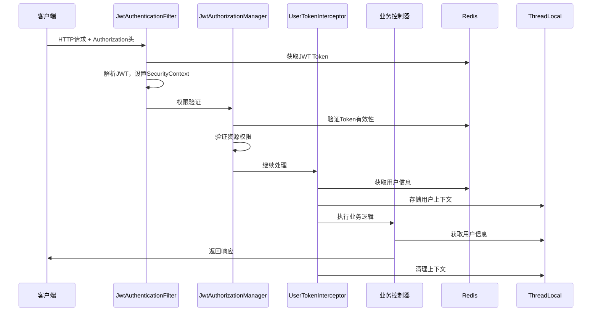

# 权限认证系统详解

## 目录
1. [系统架构概览](#系统架构概览)
2. [完整认证流程详解](#完整认证流程详解)
3. [权限控制机制](#权限控制机制)
4. [功能完善性评估](#功能完善性评估)
5. [权限使用指南](#权限使用指南)
6. [安全特性分析](#安全特性分析)
7. [最佳实践建议](#最佳实践建议)

## 系统架构概览

本项目采用 **Spring Security + JWT + Redis + ThreadLocal** 的现代化权限认证架构，实现了完整的RBAC（基于角色的访问控制）模型。

### 核心组件架构

```
┌─────────────────┐    ┌──────────────────┐    ┌─────────────────┐
│   前端客户端    │────│   Spring Security │────│   业务控制器     │
└─────────────────┘    └──────────────────┘    └─────────────────┘
                              │
                              ▼
                       ┌──────────────────┐
                       │  JwtAuthentication │
                       │      Filter      │
                       └──────────────────┘
                              │
                              ▼
                       ┌──────────────────┐
                       │ JwtAuthorization │
                       │     Manager     │
                       └──────────────────┘
                              │
                              ▼
                       ┌──────────────────┐
                       │ UserToken       │
                       │  Interceptor    │
                       └──────────────────┘
                              │
                              ▼
                       ┌──────────────────┐
                       │   ThreadLocal    │
                       │   用户上下文      │
                       └──────────────────┘
```

### 数据模型设计

```
用户(User) ──── 用户角色关联(UserRole) ──── 角色(Role)
    │                                      │
    └─────────────── 用户资源关联 ───────────┘
                     │
                     ▼
                 资源(Resource)
```

## 完整认证流程详解

### 1. 用户登录流程

#### 1.1 登录请求处理（LoginServiceImpl.login）

```java
public LoginVo login(LoginDto loginDto) {
    // 步骤1：用户认证
    UsernamePasswordAuthenticationToken authenticationToken = 
        new UsernamePasswordAuthenticationToken(loginDto.getUsername(), loginDto.getPassword());
    Authentication authenticate = authenticationManager.authenticate(authenticationToken);
    
    // 步骤2：获取用户信息
    UserAuth userAuth = (UserAuth) authenticate.getPrincipal();
    LoginVo userLoginVo = BeanUtil.copyProperties(userAuth, LoginVo.class);
    
    // 步骤3：获取角色权限
    List<Role> roleList = roleService.getRoleListByUserId(userAuth.getId());
    Set<String> roleLabelsSet = roleList.stream().map(Role::getLabel).collect(Collectors.toSet());
    userLoginVo.setRoleLabels(roleLabelsSet);
    
    // 步骤4：获取资源权限
    List<Resource> resourceList = resourceService.getResourceListByUserId(userAuth.getId());
    Set<String> resourceLabelSet = resourceList.stream()
        .filter(resource -> "r".equals(resource.getResourceType()))
        .map(Resource::getRequestPath)
        .collect(Collectors.toSet());
    userLoginVo.setResourcePaths(resourceLabelSet);
    
    // 步骤5：生成双Token
    String userToken = UUID.randomUUID().toString();
    userLoginVo.setToken(userToken);
    
    // 步骤6：JWT封装
    Map<String, Object> claims = new HashMap<>();
    String loginVoJson = JSONUtil.toJsonStr(userLoginVo);
    claims.put("currentUser", loginVoJson);
    String jwtToken = jwtUtil.generateToken(claims);
    
    // 步骤7：Redis存储
    Long ttl = Long.valueOf(jwtProperties.getExpireTime() / 1000);
    stringRedisTemplate.opsForValue().set(
        UserConstant.USER_TOKEN + userLoginVo.getUsername(), userToken, ttl, TimeUnit.SECONDS);
    stringRedisTemplate.opsForValue().set(
        UserConstant.JWT_TOKEN + userToken, jwtToken, ttl, TimeUnit.SECONDS);
    
    return userLoginVo;
}
```

#### 1.2 双Token机制详解

```java
// Redis存储结构
// Key1: USER_TOKEN + username -> Value: userToken (UUID)
// Key2: JWT_TOKEN + userToken -> Value: jwtToken (JWT字符串)

// 示例：
// USER_TOKEN_admin -> "a1b2c3d4-e5f6-7890-abcd-ef1234567890"
// JWT_TOKEN_a1b2c3d4-e5f6-7890-abcd-ef1234567890 -> "eyJhbGciOiJIUzI1NiJ9..."
```

**双Token优势**：
- **安全性**：JWT不直接暴露给客户端，减少被破解风险
- **可控性**：可通过删除Redis中的用户Token实现强制下线
- **灵活性**：支持Token续期机制

### 2. 请求认证流程

#### 2.1 请求拦截处理链



#### 2.2 JWT认证过滤器（JwtAuthenticationFilter）

```java
@Override
protected void doFilterInternal(HttpServletRequest request, HttpServletResponse response, FilterChain filterChain) {
    try {
        // 1. 提取并验证令牌
        String jwtToken = extractAndValidateToken(request);
        if (jwtToken == null) {
            filterChain.doFilter(request, response);
            return;
        }

        // 2. 解析JWT获取用户信息
        Claims claims = jwtUtil.parseToken(jwtToken);

        // 3. 构建用户认证信息
        Authentication authentication = createAuthentication(claims, request);

        // 4. 设置认证信息到安全上下文
        SecurityContextHolder.getContext().setAuthentication(authentication);
    } catch (Exception e) {
        // 异常处理，清除安全上下文
        SecurityContextHolder.clearContext();
    }

    filterChain.doFilter(request, response);
}
```

#### 2.3 JWT授权管理器（JwtAuthorizationManager）

```java
@Override
public AuthorizationDecision check(Supplier<Authentication> authentication, RequestAuthorizationContext requestContext) {
    try {
        // 1. 提取请求信息
        String requestMethodAndPath = extractRequestInfo(requestContext);

        // 2. 验证令牌存在性
        String userToken = extractUserToken(requestContext);
        if (!isTokenValid(userToken)) {
            return new AuthorizationDecision(false);
        }

        // 3. 获取并验证JWT令牌
        String jwtToken = getJwtTokenFromRedis(userToken);
        if (!isJwtTokenValid(jwtToken)) {
            return new AuthorizationDecision(false);
        }

        // 4. 解析JWT并获取用户信息
        LoginVo loginVo = parseUserInfoFromJwt(jwtToken);
        if (loginVo == null) {
            return new AuthorizationDecision(false);
        }

        // 5. 验证用户令牌一致性（防止用户被踢下线）
        if (!isUserTokenConsistent(userToken, loginVo)) {
            return new AuthorizationDecision(false);
        }

        // 6. 处理令牌续期
        renewTokenIfNecessary(userToken, jwtToken, loginVo);

        // 7. 验证资源访问权限
        if (hasResourceAccessPermission(loginVo, requestMethodAndPath)) {
            return new AuthorizationDecision(true);
        }

        return new AuthorizationDecision(false);
    } catch (Exception e) {
        return new AuthorizationDecision(false);
    }
}
```

#### 2.4 用户Token拦截器（UserTokenInterceptor）

```java
@Override
public boolean preHandle(HttpServletRequest request, HttpServletResponse response, Object handler) {
    if (!(handler instanceof HandlerMethod)) {
        return true;
    }
    
    // 从头部中拿userToken
    String userToken = request.getHeader("Authorization");
    if (!ObjectUtil.isEmpty(userToken)) {
        String jwtTokenKey = UserConstant.JWT_TOKEN + userToken;
        String jwtToken = stringRedisTemplate.opsForValue().get(jwtTokenKey);
        
        // 拿到jwt令牌不为空
        if (!ObjectUtil.isEmpty(jwtToken)) {
            // 解析jwt令牌
            Map<String, Object> claims = jwtUtil.parseToken(jwtToken);
            Object userObj = claims.get("currentUser");
            String currentUser = String.valueOf(userObj);
            
            // 将用户信息存入ThreadLocal
            UserThreadLocal.setSubject(currentUser);
        }
    }
    return true;
}

@Override
public void afterCompletion(HttpServletRequest request, HttpServletResponse response, Object handler, Exception ex) {
    // 移除当前线程变量中的数据
    UserThreadLocal.remove();
}
```

### 3. Token续期机制

```java
private void renewTokenIfNecessary(String userToken, String oldJwtToken, LoginVo loginVo) {
    String jwtTokenKey = UserConstant.JWT_TOKEN + userToken;
    Long remainTimeToLive = stringRedisTemplate.getExpire(jwtTokenKey, TimeUnit.SECONDS);

    // 检查剩余时间是否需要续期（有效且小于等于10分钟）
    if (remainTimeToLive != null && remainTimeToLive > 0 && remainTimeToLive <= 600) {
        try {
            // 生成新的JWT令牌
            Claims oldClaims = jwtUtil.parseToken(oldJwtToken);
            Map<String, Object> newClaims = Map.of("currentUser", oldClaims.get("currentUser"));
            String newJwtToken = jwtUtil.generateToken(newClaims);

            // 计算过期时间（秒）
            long ttl = jwtProperties.getExpireTime() / 1000;

            // 更新Redis中的令牌
            stringRedisTemplate.opsForValue().set(jwtTokenKey, newJwtToken, ttl, TimeUnit.SECONDS);
            stringRedisTemplate.opsForValue()
                .set(UserConstant.USER_TOKEN + loginVo.getUsername(), userToken, ttl, TimeUnit.SECONDS);

            log.debug("用户令牌已续期，用户名: {}", loginVo.getUsername());
        } catch (Exception e) {
            log.error("令牌续期失败", e);
        }
    }
}
```

## 权限控制机制

### 1. RBAC模型实现

#### 1.1 数据模型关系

```java
// 用户实体
public class User extends BaseEntity {
    private String username;
    private String password;
    private String email;
    private String phoneNumber;
    private String avatar;
}

// 角色实体
public class Role extends BaseEntity {
    private String roleName;  // 角色名称
    private String label;     // 权限标识
    private Integer sortNo;   // 排序
}

// 资源实体
public class Resource extends BaseEntity {
    private String resourceNo;        // 资源编号
    private String parentResourceNo;  // 父资源编号
    private String resourceName;      // 资源名称
    private String resourceType;      // 资源类型
    private String requestPath;       // 请求地址
    private String label;             // 权限标识
    private Integer sortNo;           // 排序
    private String icon;              // 图标
}
```

#### 1.2 权限验证逻辑

```java
private boolean hasResourceAccessPermission(LoginVo loginVo, String requestMethodAndPath) {
    Set<String> resourcePaths = loginVo.getResourcePaths();
    if (resourcePaths == null || resourcePaths.isEmpty()) {
        return false;
    }

    // 使用AntPathMatcher匹配资源路径（支持通配符）
    return resourcePaths.stream()
        .anyMatch(resourcePath -> antPathMatcher.match(resourcePath, requestMethodAndPath));
}
```

### 2. 资源权限配置

#### 2.1 资源类型说明

- **'r'**：可访问的请求路径（用于权限验证）
- **'m'**：菜单项（用于前端菜单显示）
- **'b'**：按钮权限（用于前端按钮控制）

#### 2.2 权限路径格式

```java
// 权限路径示例
"GET/api/user/list"           // 查询用户列表
"POST/api/user/create"         // 创建用户
"PUT/api/user/update/**"       // 更新用户（支持通配符）
"DELETE/api/user/delete/*"     // 删除用户（支持通配符）
"GET/api/report/**"            // 报表相关所有GET请求
```

### 3. ThreadLocal用户上下文

```java
public class UserThreadLocal {
    // 存储用户JSON信息
    public static ThreadLocal<String> subjectThreadLocal = new ThreadLocal<>();
    
    // 存储用户ID
    private static final ThreadLocal<Long> LOCAL = new ThreadLocal<>();

    // 设置用户信息
    public static void setSubject(String subject) {
        subjectThreadLocal.set(subject);
    }
    
    // 获取用户信息
    public static String getSubject() {
        return subjectThreadLocal.get();
    }
    
    // 获取用户ID
    public static Long getUserId() {
        return LOCAL.get();
    }
    
    // 清理上下文
    public static void remove() {
        subjectThreadLocal.remove();
        LOCAL.remove();
    }
}
```

## 功能完善性评估

### 1. 已实现的核心功能

#### ✅ 认证功能
- [x] 用户名密码认证
- [x] JWT Token生成与验证
- [x] 双Token机制（用户Token + JWT Token）
- [x] Token自动续期
- [x] 登录退出机制

#### ✅ 授权功能
- [x] 基于RBAC的权限模型
- [x] 细粒度资源权限控制
- [x] Ant路径匹配支持
- [x] 角色权限管理
- [x] 动态权限验证

#### ✅ 安全特性
- [x] 密码加密存储（BCrypt）
- [x] JWT签名验证
- [x] Token过期控制
- [x] 防止Token重用
- [x] 强制下线功能

#### ✅ 性能优化
- [x] Redis缓存用户权限
- [x] ThreadLocal线程隔离
- [x] 无状态会话管理
- [x] 连接池管理

### 2. 可优化的功能点

#### ⚠️ 建议增强的功能

1. **多因素认证（MFA）**
   ```java
   // 建议添加短信验证码、邮箱验证码等
   public LoginVo loginWithMFA(LoginDto loginDto, String verificationCode) {
       // 实现多因素认证逻辑
   }
   ```

2. **登录设备管理**
   ```java
   // 建议添加设备信息记录
   public void recordLoginDevice(String userId, String deviceId, String deviceInfo) {
       // 记录登录设备信息
   }
   ```

3. **权限缓存优化**
   ```java
   // 建议添加本地缓存
   @Cacheable(value = "userPermissions", key = "#userId")
   public Set<String> getUserPermissions(Long userId) {
       // 缓存用户权限信息
   }
   ```

4. **审计日志**
   ```java
   // 建议添加操作审计
   @EventListener
   public void handleAuthenticationSuccess(AuthenticationSuccessEvent event) {
       // 记录登录成功日志
   }
   ```

5. **会话管理**
   ```java
   // 建议添加会话管理功能
   public List<ActiveSession> getUserActiveSessions(String userId) {
       // 获取用户活跃会话
   }
   ```

### 3. 安全性评估

#### ✅ 安全优势
- 双Token机制降低JWT暴露风险
- Redis存储实现Token可控性
- BCrypt密码加密
- 防止用户被踢下线后继续访问
- 自动Token续期避免频繁登录

#### ⚠️ 安全建议
1. **JWT密钥管理**：建议使用专门的密钥管理服务
2. **防暴力破解**：建议添加登录失败次数限制
3. **IP白名单**：建议添加IP访问控制
4. **请求频率限制**：建议添加API限流机制

## 权限使用指南

### 1. 基础配置

#### 1.1 application.yml配置

```yaml
zl:
  token:
    secret: your-secret-key-here  # JWT密钥
    expireTime: 7200000          # Token过期时间（2小时）
    header: Authorization         # 请求头名称
  framework:
    security:
      ignoreUrl:                  # 忽略认证的URL
        - /api/auth/login
        - /api/auth/register
        - /swagger-ui/**
        - /v3/api-docs/**
      defaulePassword: 123456    # 默认密码
```

#### 1.2 资源权限配置示例

```sql
-- 角色表数据
INSERT INTO role (id, role_name, label, sort_no) VALUES
(1, '超级管理员', 'ADMIN', 1),
(2, '普通用户', 'USER', 2),
(3, '访客', 'GUEST', 3);

-- 资源表数据
INSERT INTO resource (id, resource_no, parent_resource_no, resource_name, resource_type, request_path, label) VALUES
(1, 'R001', NULL, '用户管理', 'm', NULL, 'user:manage'),
(2, 'R001001', 'R001', '用户列表', 'r', 'GET/api/user/list', 'user:list'),
(3, 'R001002', 'R001', '创建用户', 'r', 'POST/api/user/create', 'user:create'),
(4, 'R001003', 'R001', '更新用户', 'r', 'PUT/api/user/update/*', 'user:update'),
(5, 'R001004', 'R001', '删除用户', 'r', 'DELETE/api/user/delete/*', 'user:delete');

-- 用户角色关联
INSERT INTO user_role (user_id, role_id) VALUES
(1, 1),  -- 用户1拥有超级管理员角色
(2, 2),  -- 用户2拥有普通用户角色
(3, 3);  -- 用户3拥有访客角色

-- 角色资源关联
INSERT INTO role_resource (role_id, resource_id) VALUES
(1, 1), (1, 2), (1, 3), (1, 4), (1, 5),  -- 超级管理员拥有所有权限
(2, 2), (2, 3),                              -- 普通用户只能查看和创建
(3, 2);                                       -- 访客只能查看
```

### 2. 代码中使用权限

#### 2.1 获取当前用户信息

```java
@RestController
@RequestMapping("/api/user")
public class UserController {
    
    @GetMapping("/profile")
    public Result<UserProfile> getUserProfile() {
        // 方式1：从ThreadLocal获取
        String userJson = UserThreadLocal.getSubject();
        LoginVo currentUser = JSON.parseObject(userJson, LoginVo.class);
        
        // 方式2：从SecurityContext获取
        Authentication authentication = SecurityContextHolder.getContext().getAuthentication();
        UserAuth userAuth = (UserAuth) authentication.getPrincipal();
        
        return Result.success(buildUserProfile(currentUser));
    }
    
    @GetMapping("/current-id")
    public Result<Long> getCurrentUserId() {
        // 直接获取用户ID
        Long userId = UserThreadLocal.getUserId();
        return Result.success(userId);
    }
}
```

#### 2.2 权限验证

```java
@RestController
@RequestMapping("/api/admin")
public class AdminController {
    
    @GetMapping("/users")
    @PreAuthorize("hasAuthority('user:list')")  // 方法级权限验证
    public Result<List<User>> getUserList() {
        // 只有拥有'user:list'权限的用户才能访问
        return Result.success(userService.getAllUsers());
    }
    
    @PostMapping("/users")
    @PreAuthorize("hasAuthority('user:create')")
    public Result<User> createUser(@RequestBody UserDto userDto) {
        // 只有拥有'user:create'权限的用户才能访问
        return Result.success(userService.createUser(userDto));
    }
    
    @DeleteMapping("/users/{id}")
    @PreAuthorize("hasAuthority('user:delete')")
    public Result<Void> deleteUser(@PathVariable Long id) {
        // 只有拥有'user:delete'权限的用户才能访问
        userService.deleteUser(id);
        return Result.success();
    }
}
```

#### 2.3 自定义权限验证

```java
@Component
public class CustomPermissionEvaluator {
    
    public boolean hasPermission(Authentication authentication, String permission) {
        if (authentication == null || !authentication.isAuthenticated()) {
            return false;
        }
        
        UserAuth userAuth = (UserAuth) authentication.getPrincipal();
        return userAuth.getAuthorities().stream()
            .anyMatch(authority -> authority.getAuthority().equals(permission));
    }
    
    public boolean hasAnyPermission(Authentication authentication, String... permissions) {
        if (authentication == null || !authentication.isAuthenticated()) {
            return false;
        }
        
        UserAuth userAuth = (UserAuth) authentication.getPrincipal();
        Set<String> userPermissions = userAuth.getAuthorities().stream()
            .map(GrantedAuthority::getAuthority)
            .collect(Collectors.toSet());
            
        return Arrays.stream(permissions)
            .anyMatch(userPermissions::contains);
    }
}
```

### 3. 前端权限控制

#### 3.1 请求头设置

```javascript
// axios拦截器设置
axios.interceptors.request.use(config => {
    const token = localStorage.getItem('userToken');
    if (token) {
        config.headers.Authorization = `Bearer ${token}`;
    }
    return config;
});

// 响应拦截器处理Token续期
axios.interceptors.response.use(response => {
    // 检查是否有新的Token
    const newToken = response.headers['x-new-token'];
    if (newToken) {
        localStorage.setItem('userToken', newToken);
    }
    return response;
}, error => {
    if (error.response?.status === 401) {
        // Token过期或无效，跳转到登录页
        router.push('/login');
    }
    return Promise.reject(error);
});
```

#### 3.2 菜单权限控制

```javascript
// 根据用户权限过滤菜单
function filterMenusByPermission(menus, userPermissions) {
    return menus.filter(menu => {
        if (menu.permission && !userPermissions.includes(menu.permission)) {
            return false;
        }
        if (menu.children) {
            menu.children = filterMenusByPermission(menu.children, userPermissions);
        }
        return true;
    });
}

// 使用示例
const userPermissions = getUserPermissions(); // 从登录响应中获取
const filteredMenus = filterMenusByPermission(allMenus, userPermissions);
```

#### 3.3 按钮权限控制

```javascript
// Vue指令实现按钮权限控制
Vue.directive('permission', {
    inserted(el, binding) {
        const { value } = binding;
        const userPermissions = store.getters.permissions;
        
        if (value && !userPermissions.includes(value)) {
            el.parentNode && el.parentNode.removeChild(el);
        }
    }
});

// 使用示例
<button v-permission="'user:create'">创建用户</button>
<button v-permission="'user:delete'">删除用户</button>
```

## 安全特性分析

### 1. Token安全机制

#### 1.1 双Token设计优势

```java
// 传统单Token问题
// 客户端直接存储JWT，容易被破解和滥用

// 双Token解决方案
// 1. 客户端只存储用户Token（UUID）
// 2. JWT存储在Redis中，服务端可控
// 3. 支持强制下线、Token续期等高级功能
```

#### 1.2 Token续期机制

```java
// 自动续期逻辑
private void renewTokenIfNecessary(String userToken, String oldJwtToken, LoginVo loginVo) {
    Long remainTimeToLive = stringRedisTemplate.getExpire(jwtTokenKey, TimeUnit.SECONDS);
    
    // 剩余时间≤10分钟时自动续期
    if (remainTimeToLive != null && remainTimeToLive > 0 && remainTimeToLive <= 600) {
        // 生成新JWT并更新Redis
        String newJwtToken = jwtUtil.generateToken(newClaims);
        stringRedisTemplate.opsForValue().set(jwtTokenKey, newJwtToken, ttl, TimeUnit.SECONDS);
    }
}
```

### 2. 防护机制

#### 2.1 防止Token重用

```java
// 用户一致性验证
private boolean isUserTokenConsistent(String userToken, LoginVo loginVo) {
    String currentUserToken = stringRedisTemplate.opsForValue()
        .get(UserConstant.USER_TOKEN + loginVo.getUsername());
    return userToken.equals(currentUserToken);
}

// 如果用户被踢下线，Token将不一致，访问被拒绝
```

#### 2.2 防止JWT伪造

```java
// JWT签名验证
public Claims parseToken(String token) {
    try {
        return Jwts.parser()
            .setSigningKey(getKey())  // 使用密钥验证签名
            .build()
            .parseClaimsJws(token)
            .getBody();
    } catch (JwtException e) {
        throw new RuntimeException("Invalid JWT token", e);
    }
}
```

### 3. 会话管理

#### 3.1 无状态会话

```java
// Spring Security配置
@Bean
public SecurityFilterChain securityFilterChain(HttpSecurity http) throws Exception {
    http.sessionManagement(session -> 
        session.sessionCreationPolicy(SessionCreationPolicy.STATELESS));
    // 无状态会话，支持水平扩展
}
```

#### 3.2 强制下线机制

```java
// 退出登录时删除所有Token
public Boolean logout() {
    String userTokenKey = UserConstant.USER_TOKEN + userVo.getUsername();
    stringRedisTemplate.delete(userTokenKey);  // 删除用户Token映射
    
    String jwtTokenKey = UserConstant.JWT_TOKEN + userVo.getToken();
    stringRedisTemplate.delete(jwtTokenKey);   // 删除JWT Token映射
    
    return true;
}
```

## 最佳实践建议

### 1. 开发最佳实践

#### 1.1 权限设计原则

```java
// 1. 遵循最小权限原则
// 只给用户必需的权限，避免过度授权

// 2. 权限命名规范
// 格式：模块:操作:资源
// 示例：user:create:admin, user:read:all, order:update:own

// 3. 资源路径设计
// 使用RESTful风格，支持通配符
// 示例：GET/api/users, POST/api/users, PUT/api/users/{id}
```

#### 1.2 异常处理

```java
@ControllerAdvice
public class SecurityExceptionHandler {
    
    @ExceptionHandler(AccessDeniedException.class)
    public Result<Void> handleAccessDenied(AccessDeniedException e) {
        log.warn("访问被拒绝: {}", e.getMessage());
        return Result.error(403, "访问被拒绝，权限不足");
    }
    
    @ExceptionHandler(AuthenticationException.class)
    public Result<Void> handleAuthentication(AuthenticationException e) {
        log.warn("认证失败: {}", e.getMessage());
        return Result.error(401, "认证失败，请重新登录");
    }
}
```

### 2. 运维最佳实践

#### 2.1 监控指标

```java
// 建议监控的指标
1. 登录成功率/失败率
2. Token续期频率
3. 权限验证耗时
4. 并发用户数
5. Redis内存使用情况
```

#### 2.2 日志记录

```java
// 关键操作日志
@Aspect
@Component
public class SecurityLogAspect {
    
    @Around("@annotation(org.springframework.web.bind.annotation.RequestMapping)")
    public Object logSecurity(ProceedingJoinPoint joinPoint) throws Throwable {
        HttpServletRequest request = getCurrentRequest();
        String userToken = request.getHeader("Authorization");
        
        log.info("用户访问: {} {}", request.getMethod(), request.getRequestURI());
        
        try {
            Object result = joinPoint.proceed();
            log.info("访问成功: {}", request.getRequestURI());
            return result;
        } catch (Exception e) {
            log.error("访问失败: {} - {}", request.getRequestURI(), e.getMessage());
            throw e;
        }
    }
}
```

### 3. 性能优化建议

#### 3.1 权限缓存优化

```java
// 本地缓存用户权限
@Cacheable(value = "userPermissions", key = "#userId", unless = "#result == null")
public Set<String> getUserPermissions(Long userId) {
    // 从数据库查询用户权限
    return resourceService.getResourcePathsByUserId(userId);
}

// 定时刷新缓存
@Scheduled(fixedRate = 300000) // 5分钟
public void refreshPermissionCache() {
    // 刷新频繁访问的用户权限缓存
}
```

#### 3.2 数据库优化

```sql
-- 权限查询优化索引
CREATE INDEX idx_user_role_user_id ON user_role(user_id);
CREATE INDEX idx_role_resource_role_id ON role_resource(role_id);
CREATE INDEX idx_resource_type ON resource(resource_type);

-- 权限查询SQL优化
SELECT DISTINCT r.request_path 
FROM resource r
JOIN role_resource rr ON r.id = rr.resource_id
JOIN user_role ur ON rr.role_id = ur.role_id
WHERE ur.user_id = ? 
  AND r.resource_type = 'r';
```

## 总结

本项目的权限认证系统设计完善，具有以下特点：

### 优势
1. **架构清晰**：分层设计，职责明确
2. **安全可靠**：双Token机制，多重验证
3. **性能优秀**：Redis缓存，ThreadLocal隔离
4. **扩展性强**：支持RBAC模型，灵活配置
5. **用户体验好**：自动续期，无感刷新

### 改进空间
1. **多因素认证**：可增加短信、邮箱验证
2. **设备管理**：可增加登录设备管理
3. **审计日志**：可增加操作审计功能
4. **限流防护**：可增加API限流机制

这是一个企业级的权限认证解决方案，能够满足大多数业务场景的需求，具有良好的安全性和可扩展性。